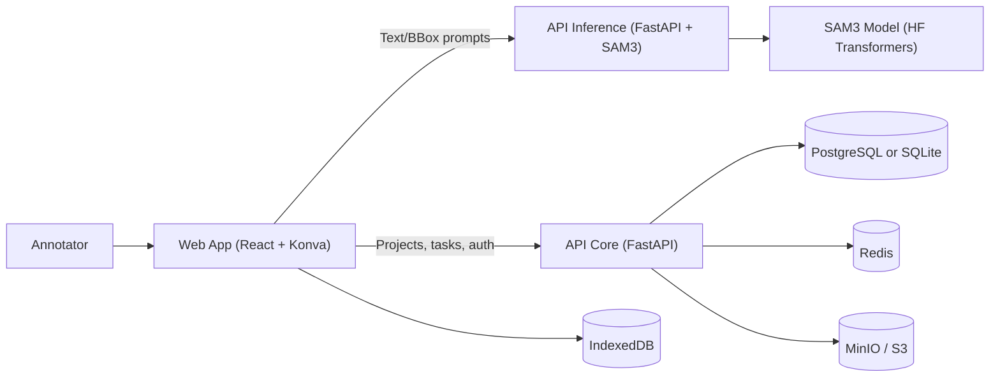

<div align="center">
  

  # AnnotateANU

  **Local-first image annotation with SAM3-powered segmentation.**

  AnnotateANU combines SAM3 prompts with a fast React canvas UI. Run everything locally,
  keep data in your browser or your own stack, and export in standard ML formats.

  [](https://github.com/agfianf/annotate-anu.git)
  [](https://github.com/agfianf/annotate-anu.git)
  [](https://huggingface.co/facebook/sam3)

  [Get Started](#quick-start) · [Docs](#docs) · [Report Bug](https://github.com/agfianf/annotate-anu/issues)
</div>

---

## Table of Contents

- [Overview](#overview)
- [Demo Gallery](#demo-gallery)
- [Features](#features)
- [Web App Highlights](#web-app-highlights)
- [Architecture](#architecture)
- [Quick Start](#quick-start)
- [Local Development](#local-development)
- [Configuration](#configuration)
- [Docs](#docs)
- [License](#license)

## Overview

AnnotateANU is a full-stack annotation platform for computer vision datasets. It pairs
SAM3 segmentation with a Konva-powered canvas for fast editing, and supports local-first
storage or a team stack with Postgres, MinIO, and Redis.

## Demo Gallery

| Demo | GIF | Description |
| --- | --- | --- |
| Landing flow |  | Product landing, onboarding entry, and top-level navigation. |
| Annotation workflow |  | Prompt, mask, edit, and export loop in the canvas. |
| Batch labeling (placeholder) |  | Placeholder for multi-image queue labeling and export. |

<details>
<summary>More demos (expand)</summary>

| Demo | GIF | Description |
| --- | --- | --- |
| Project dashboard (placeholder) |  | Project stats, recent activity, and quick navigation. |
| Project detail tabs (placeholder) |  | README editor, configuration, history, and explore view. |
| Task creation wizard (placeholder) |  | Guided task setup with quick-create options. |
| Job assignment + filters (placeholder) |  | Assignees, status filters, and job queue controls. |
| BYOM registry (placeholder) |  | Register external models and run health checks. |
| File share explorer (placeholder) |  | Browse shared files and upload assets. |
| Admin user management (placeholder) |  | Roles, activation toggles, and user cleanup. |
</details>

## Features

- **SAM3 prompts**: Text and bounding box prompts for instant masks.
- **Precision tools**: Rectangle, polygon, and point tools for manual edits.
- **Batch workflows**: Queue large image sets without UI lag.
- **Exports**: COCO, YOLO, and ZIP exports for training pipelines.
- **Local-first storage**: IndexedDB by default, optional team stack.

## Web App Highlights

- **Project dashboard**: Stats, recent projects, and navigation shortcuts.
- **Project workspace**: README editor, configuration, history, and explore views.
- **Tasks and jobs**: Create tasks, assign jobs, filter by status.
- **BYOM management**: Register models, define capabilities, run health checks.
- **File sharing**: Server-side browser with multi-select and upload support.
- **Admin + profile**: Role management, activation toggles, profile updates.

## Architecture



Diagram source: `docs/architecture/system-overview.mmd`

**Repo layout**

```
sam3-app/
├── apps/
│   ├── api-inference/    # SAM3 inference API (FastAPI)
│   ├── api-core/         # Core API (auth, projects, BYOM)
│   └── web/              # React annotation UI
├── docker/               # Compose files for dev/solo/team
└── docs/
```

## Quick Start

### Prerequisites

- Docker + Docker Compose
- HuggingFace account and token (SAM3 is gated)

### HuggingFace Token

1. Request access: https://huggingface.co/facebook/sam3
2. Create a token: https://huggingface.co/settings/tokens
3. Add it to `apps/api-inference/.env`:

```bash
cp apps/api-inference/.env.example apps/api-inference/.env
# Edit apps/api-inference/.env and set:
HF_TOKEN=hf_your_token_here
```

### Start the stack (dev)

```bash
make docker-up
```

Services:
- Frontend: http://localhost:5173
- SAM3 API: http://localhost:8000/docs
- Core API: http://localhost:8001/docs

### Deployment modes

| Mode | Compose file | Default URL | Notes |
| --- | --- | --- | --- |
| Dev | `docker/docker-compose.dev.yml` | http://localhost:5173 | Hot-reload, Redis included. |
| Solo | `docker/docker-compose.solo.yml` | http://localhost:3000 | IndexedDB-only, no auth. |
| Team | `docker/docker-compose.team.yml` | http://localhost | Postgres, MinIO, Redis, auth. |

## Local Development

```bash
# Backend (SAM3)
make backend-install
make backend-run

# Core API
make core-install
make core-run

# Frontend
make frontend-install
make frontend-dev
```

## Configuration

- `apps/api-inference/.env` - SAM3 settings (requires `HF_TOKEN`).
- `apps/api-core/.env` - Core API settings (database, JWT, Redis).
- `apps/web/.env` - Frontend URLs and storage mode.

Examples are in each app's `.env.example` file.

## Docs

- Getting started: `docs/getting-started.md`
- Architecture notes: `docs/architecture/`
- BYOM guide: `docs/byom-integration-guide/`
- Docker modes: `docker/README.md`

## License

MIT License - see `LICENSE`.
