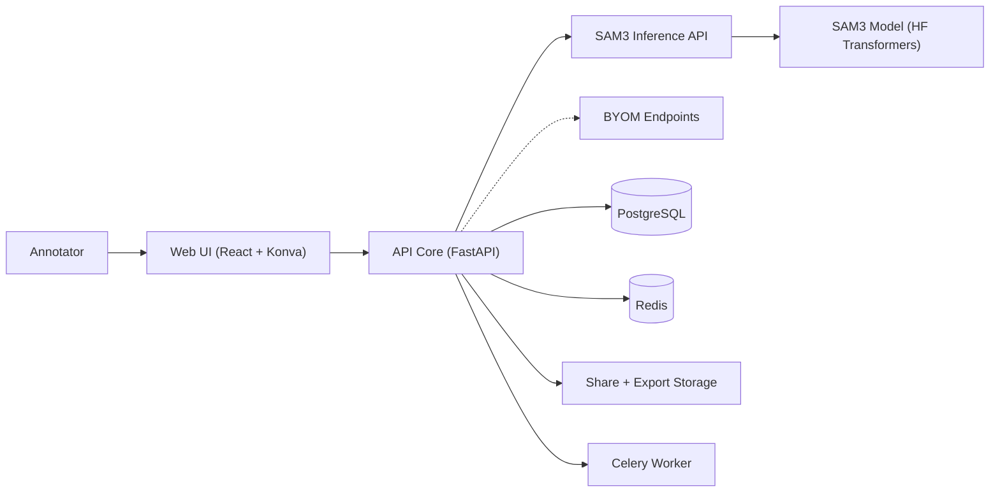

<div align="center">
  

  # AnnotateANU

  **Self-hosted image annotation with SAM3 + BYOM.**

  AnnotateANU pairs a fast React/Konva canvas with SAM3 segmentation and a model
  registry for external endpoints. Run everything locally, keep data in your
  environment, and export to standard ML formats.

  [](https://github.com/agfianf/annotate-anu.git)
  [](https://github.com/agfianf/annotate-anu.git)
  [](https://huggingface.co/facebook/sam3)

  [Get Started](#quick-start) · [Docs](#docs) · [Report Bug](https://github.com/agfianf/annotate-anu/issues)
</div>

---

## Table of Contents

- [Overview](#overview)
- [Demo Gallery](#demo-gallery)
- [Current Features](#current-features)
- [Services](#services)
- [Architecture](#architecture)
- [Quick Start](#quick-start)
- [Local Development](#local-development)
- [Configuration](#configuration)
- [Docs](#docs)
- [License](#license)

## Overview

AnnotateANU is a full-stack image annotation platform for computer vision datasets.
It combines SAM3 segmentation, manual tools, and a project workflow with tasks,
jobs, and export history. The stack is self-hosted and runs via Docker Compose.

## Demo Gallery

| Demo | GIF | Description |
| --- | --- | --- |
| Landing flow |  | Marketing landing, onboarding entry, and navigation. |
| Annotation workflow |  | Prompt, mask, edit, and export loop in the canvas. |
| Batch labeling (placeholder) |  | Placeholder for multi-image prompt runs and review. |

<details>
<summary>More demos (expand)</summary>

| Demo | GIF | Description |
| --- | --- | --- |
| Project dashboard (placeholder) |  | Project stats, recent activity, and shortcuts. |
| Project detail tabs (placeholder) |  | README editor, configuration, history, and explore views. |
| Task creation wizard (placeholder) |  | Guided task setup with file share selection. |
| Job assignment (placeholder) |  | Assignees, status filters, and job queue controls. |
| BYOM registry (placeholder) |  | Register models, define capabilities, run health checks. |
| Explore filters (placeholder) |  | Tags, categories, metadata filters, and bulk actions. |
| Export history (placeholder) |  | Versioned exports with diff and download. |
| Admin users (placeholder) |  | Roles, activation toggles, and user cleanup. |
</details>

## Current Features

### Annotation workspace

- Canvas tools: select/move, rectangle, polygon, vertex editing, and delete.
- Zoom, pan, and autofit with undo/redo and keyboard shortcuts.
- Label management with colors, visibility toggles, and auto/manual filters.
- Multi-image gallery with thumbnails and folder upload (browser supported).

### AI assist (SAM3 and BYOM via API Core)

- Text prompts with single, auto-apply, and batch modes.
- Bbox prompts for single-image segmentation (auto-apply and batch disabled).
- Auto-detect mode when the selected model supports it.
- Auto-generated annotations carry confidence and can be filtered or removed.

### Model registry (BYOM)

- Built-in SAM3 plus external model endpoints.
- Capability flags (text, bbox, auto-detect) and response mapping.
- Health checks and active/inactive toggles.

### Projects and workflow

- Projects, tasks, and jobs with archive and delete actions.
- Job assignment, status filters, and per-project model restrictions.
- Project README editor, configuration, history, and explore tabs.
- Task creation wizard with file share selection or upload (legacy).
- File share browser for server-side datasets.

### Explore and analytics

- Virtualized image grid for large datasets.
- Tag/category filters, match modes, and metadata range filters.
- Bulk tag and visibility actions, color editing, and inline tag creation.
- Fullscreen preview with annotation overlays and metadata panels.
- Analytics panel system (dataset stats and model analysis panels).

### Export

- Local exports from the annotation app to COCO JSON and YOLO ZIP.
- Project export wizard with versioned history and diff views (API Core worker).

### Storage and sync

- Local mode stores images and annotations in IndexedDB.
- Job mode syncs to API Core with autosave and status indicators.
- Project metadata and registry data stored in Postgres.

## Services

| Service | Responsibility | Port |
| --- | --- | --- |
| Web app | Annotation UI, dashboards, explore, exports | 5173 |
| API Core | Auth, projects, tasks, jobs, model registry, inference proxy | 8001 |
| SAM3 Inference API | SAM3 segmentation endpoints | 8000 |
| API Core Worker | Background tasks (exports, long jobs) | - |
| PostgreSQL | Project and annotation data | 5432 |
| Redis | Cache and task queue | 6379 |

## Architecture



Diagram source: `docs/architecture/system-overview.mmd`

## Quick Start

### Prerequisites

- Docker + Docker Compose
- HuggingFace account and token (SAM3 is gated)

### Setup

```bash
cp apps/api-inference/.env.example apps/api-inference/.env
cp apps/api-core/.env.example apps/api-core/.env
cp apps/web/.env.example apps/web/.env
```

Add your HuggingFace token to `apps/api-inference/.env`:

```bash
HF_TOKEN=hf_your_token_here
```

### Start the stack

```bash
make docker-up
```

Services:
- Web: http://localhost:5173
- SAM3 API docs: http://localhost:8000/docs
- API Core docs: http://localhost:8001/docs

Note: the repository includes other compose files, but the supported entry point
is `docker/docker-compose.dev.yml`.

## Local Development

```bash
# SAM3 inference
make backend-install
make backend-run

# API core
make core-install
make core-run

# Web app
make frontend-install
make frontend-dev
```

## Configuration

- `apps/api-inference/.env` - SAM3 settings (requires `HF_TOKEN`).
- `apps/api-core/.env` - Core API settings (database, JWT, Redis).
- `apps/web/.env` - Frontend URLs and environment.

## Docs

- Getting started: `docs/getting-started.md`
- Explore filters and gallery: `docs/explore-sidebar-image-gallery.md`
- Export workflow: `docs/export-workflow.md`
- Data management notes: `docs/data-management-feature.md`
- Documentation index: `docs/README.md`

## License

MIT License - see `LICENSE`.
