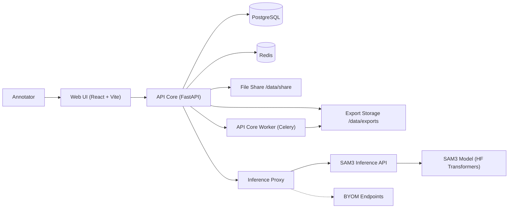

<div align="center">
  

  # AnnotateANU

  Self-hosted image annotation with SAM3-assisted segmentation and BYOM inference.

  AnnotateANU pairs a React/Konva canvas with a FastAPI core for projects, tasks, and exports.
  The supported setup is the Docker dev stack (web + API Core + SAM3 + worker + Postgres + Redis).

  [](https://github.com/agfianf/annotate-anu.git)
  [](https://github.com/agfianf/annotate-anu.git)
  [](https://huggingface.co/facebook/sam3)

  [Get Started](#quick-start) · [Docs](docs/Navigation.md) · [API Docs](#api-docs) · [Report Bug](https://github.com/agfianf/annotate-anu/issues)
</div>

---

## Overview

AnnotateANU is a full-stack image annotation platform for computer vision datasets.
It includes a SAM3 inference service, a core API for workflow and data management,
and a React/Konva UI for annotation, exploration, and exports.

## Features

- Annotation canvas with rectangle, polygon, and point tools, selection, vertex editing, zoom/pan, undo/redo, and shortcuts.
- SAM3 text and bbox prompts with single, auto-apply, and batch modes plus auto-detect helpers.
- Projects, tasks, and jobs with assignment, status tracking, approvals, and train/val/test splits.
- File share browser with uploads, shared image registry, project image pools, and tag/category metadata.
- Explore view with a virtualized gallery, filters, bulk tagging, and analytics panels.
- **Analytics panels**: Dataset statistics, annotation analysis, spatial heatmaps, and image quality metrics with multi-select filtering.
- **Image quality metrics**: Background processing for sharpness, brightness, contrast, uniqueness with real-time progress tracking.
- Exports: server-side datasets (COCO JSON, manifest CSV, image folders) plus local COCO/YOLO export from the annotation app.
- BYOM registry with inference proxy, plus admin user management and role-based auth.

## Demo

### Hero GIFs (Top Priority)

| Demo | GIF | Description |
| --- | --- | --- |
| Landing |  | Marketing landing and onboarding |
| Annotation workflow |  | Prompt, mask, edit, and export in the canvas |

### AI-Powered Annotation

| Demo | GIF | Description |
| --- | --- | --- |
| SAM3 Text Prompt |  | Type "cat" → instant segmentation mask |
| SAM3 Bbox Prompt |  | Draw rough box → SAM refines to perfect polygon |
| Polygon Simplification |  | Reduce polygon points for easier editing |
| BYOM Inference |  | Bring your own model for custom detection |

### Explore & Analytics

| Demo | GIF | Description |
| --- | --- | --- |
| Virtualized Gallery |  | Smooth scrolling through 1000+ images |
| Tri-State Filtering |  | Include/exclude/idle tag states with AND/OR |
| Histogram Filters |  | Click histogram bars to filter by dimension |
| Quality Metrics |  | Background processing with progress tracking |
| Confidence Slider |  | Filter annotations by confidence range |

> **Note**: Replace placeholder GIFs above with actual recordings. See [GIF Recording Guide](docs/features/explore-gallery.md#gif-recording-guide) for details.

## Why AnnotateANU?

| Feature | AnnotateANU | CVAT | FiftyOne | Encord | Roboflow |
|---------|:-----------:|:----:|:--------:|:------:|:--------:|
| **Self-Hosted** | ✅ | ✅ | ✅ | ❌ | ⚠️ |
| **SAM3 Integration** | ✅ Native | ✅ | ❌ | ✅ | ✅ |
| **Text Prompts** | ✅ | ❌ | ❌ | ✅ | ✅ |
| **BYOM Support** | ✅ | ⚠️ | ❌ | ⚠️ | ❌ |
| **Tri-State Tag Filters** | ✅ | ❌ | ⚠️ | ⚠️ | ❌ |
| **Histogram Filtering** | ✅ | ❌ | ✅* | ⚠️ | ✅ |
| **Quality Metrics** | ✅ | ❌ | ⚠️* | ✅ | ❌ |
| **Model Source Tracking** | ✅ | ❌ | ✅ | ⚠️ | ❌ |
| **Polygon Simplification** | ✅ | ❌ | ❌ | ❌ | ❌ |

*\*Requires Python code*

### Key Differentiators

- **🎯 Tri-State Tag Filtering**: Include, exclude, or ignore tags with AND/OR logic—unique to AnnotateANU
- **📊 Integrated Analytics**: Built-in histograms, heatmaps, and quality metrics without code
- **🤖 BYOM Registry**: Register and use your own inference endpoints alongside SAM3
- **⚡ Real-time Confidence Filtering**: Slider-based annotation filtering by confidence score
- **🔧 Polygon Simplification**: Reduce polygon complexity for better performance

## Architecture



Diagram source: `docs/architecture/system-overview.mmd`.

## Services (Docker dev stack)

| Service | Responsibility | Port |
| --- | --- | --- |
| Web app | Annotation UI, dashboards, explore, exports | 5173 |
| API Core | Auth, projects, tasks, jobs, model registry, exports | 8001 |
| SAM3 Inference API | Text, bbox, batch segmentation | 8000 |
| API Core Worker | Export jobs and background tasks | - |
| PostgreSQL | Core data store | 5432 |
| Redis | Cache and task queue | - |

## Quick Start

### Prerequisites

- Docker + Docker Compose
- HuggingFace token for `facebook/sam3` (model access is gated)

### Configure env files

```bash
cp apps/api-inference/.env.example apps/api-inference/.env
cp apps/api-core/.env.example apps/api-core/.env
cp apps/web/.env.example apps/web/.env
```

Add your HuggingFace token in `apps/api-inference/.env`:

```bash
HF_TOKEN=hf_your_token_here
```

### Start the stack

```bash
make docker-up
```

Services:
- Web: http://localhost:5173
- SAM3 API docs: http://localhost:8000/docs
- API Core docs: http://localhost:8001/docs

## Local Development (no Docker)

```bash
# SAM3 inference
make backend-install
make backend-run

# API core
make core-install
make core-run

# Web app
make frontend-install
make frontend-dev
```

## Configuration

- `apps/api-inference/.env`
  - `HF_TOKEN` (required)
  - `SAM3_MODEL_NAME`, `SAM3_DEVICE` (`auto`, `cpu`, `cuda`)
  - `MAX_IMAGE_SIZE_MB`, `MAX_BATCH_SIZE`, `MAX_IMAGE_DIMENSION`
- `apps/api-core/.env`
  - `DATABASE_URL`, `DATABASE_URL_SYNC`
  - `REDIS_URL`
  - `SAM3_API_URL`
  - `JWT_SECRET_KEY`
- `apps/web/.env`
  - `VITE_SAM3_API_URL`
  - `VITE_CORE_API_URL`
  - `VITE_ENV`

## API Docs

- SAM3 Inference API: http://localhost:8000/docs
- API Core: http://localhost:8001/docs
