  <h1>AnnotateANU Documentation</h1>
  
Code-sourced docs organized by topic. Start here, then follow the category that matches your goal.

  

    
    
    
    
  

## Docs Map

```mermaid
flowchart TB
  nav["Docs Navigation"]
  nav --> features["Features"]
  nav --> architecture["Architecture"]
  nav --> development["Development"]
  nav --> userguide["User Guide"]

  features --> f1["features/data-management.md"]
  features --> f2["features/explore-gallery.md"]
  features --> f3["features/export-workflow.md"]

  architecture --> a1["architecture/README.md"]
  architecture --> a2["architecture/annotation-sync.md"]
  architecture --> a3["architecture/hybrid-canvas.md"]
  architecture --> a4["architecture/pixi-performance.md"]

  development --> d1["development/getting-started.md"]
  development --> d2["development/api-specs.md"]
  development --> d3["development/byom-integration.md"]
  development --> d4["development/color-theme-guide.md"]
  development --> d5["development/docs-navigation.mmd"]

  userguide --> u1["user-guide/annotation-workspace.md"]
```

Diagram source: `docs/development/docs-navigation.mmd`.

## Categories

<table>
  <tr>
    <td>
      <h3>Features</h3>
      
How core features behave and how to use them.

      <ul>
        <li><a href="features/data-management.md">Data management and tasks</a></li>
        <li><a href="features/explore-gallery.md">Explore gallery and filters</a></li>
        <li><a href="features/export-workflow.md">Export workflow</a></li>
      </ul>
    </td>
    <td>
      <h3>User Guide</h3>
      
Day-to-day workflows inside the UI.

      <ul>
        <li><a href="user-guide/annotation-workspace.md">Annotation workspace</a></li>
      </ul>
    </td>
  </tr>
  <tr>
    <td>
      <h3>Architecture</h3>
      
System structure, data flow, and performance notes.

      <ul>
        <li><a href="architecture/README.md">Architecture overview</a></li>
        <li><a href="architecture/annotation-sync.md">Annotation sync (job mode)</a></li>
        <li><a href="architecture/hybrid-canvas.md">Canvas architecture</a></li>
        <li><a href="architecture/pixi-performance.md">Pixi experiments</a></li>
        <li><a href="architecture/database-schema.dbml">Database schema</a></li>
      </ul>
    </td>
    <td>
      <h3>Development</h3>
      
Setup, configuration, and integration references.

      <ul>
        <li><a href="development/getting-started.md">Getting started</a></li>
        <li><a href="development/api-specs.md">API summary</a></li>
        <li><a href="development/byom-integration.md">BYOM integration</a></li>
        <li><a href="development/color-theme-guide.md">Color theme guide</a></li>
      </ul>
    </td>
  </tr>
</table>
