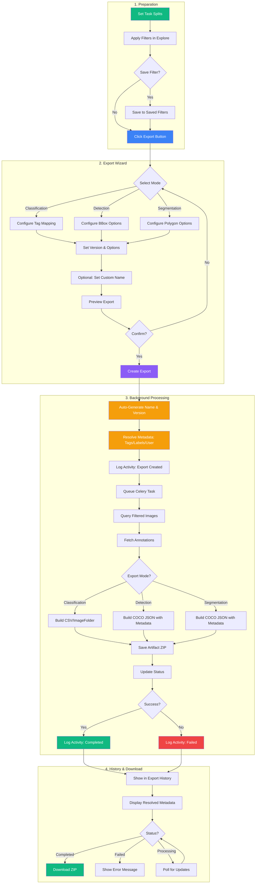
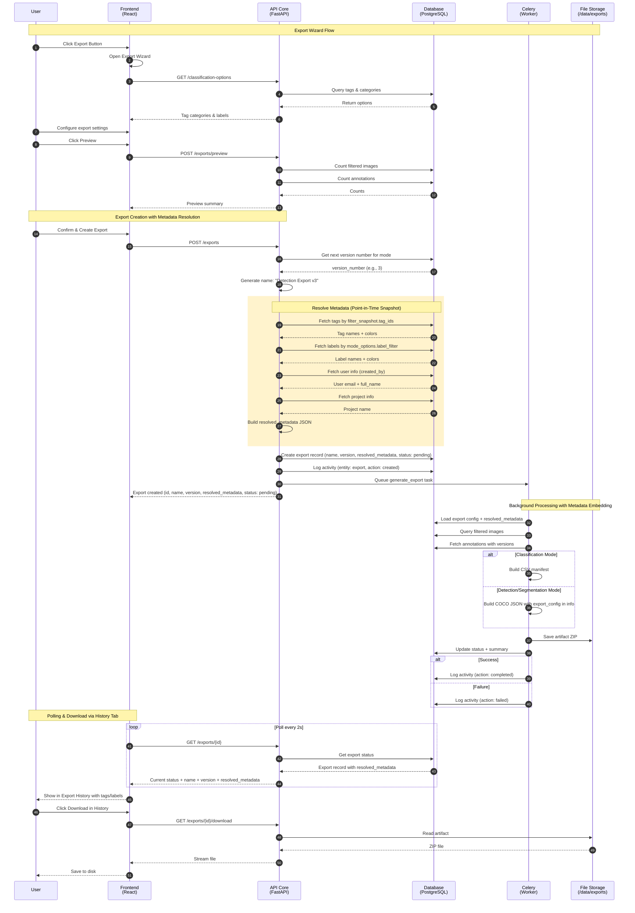
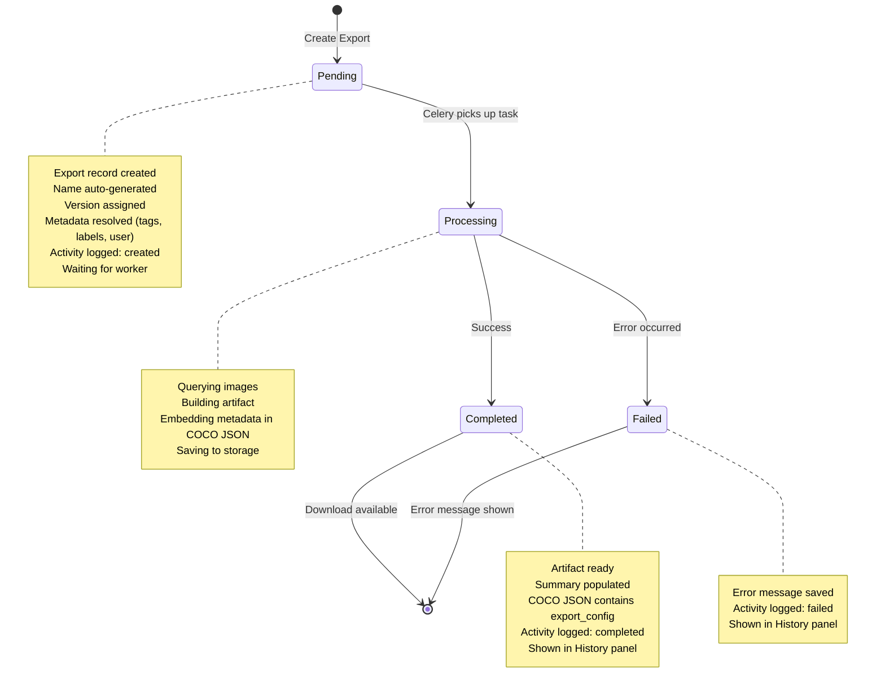
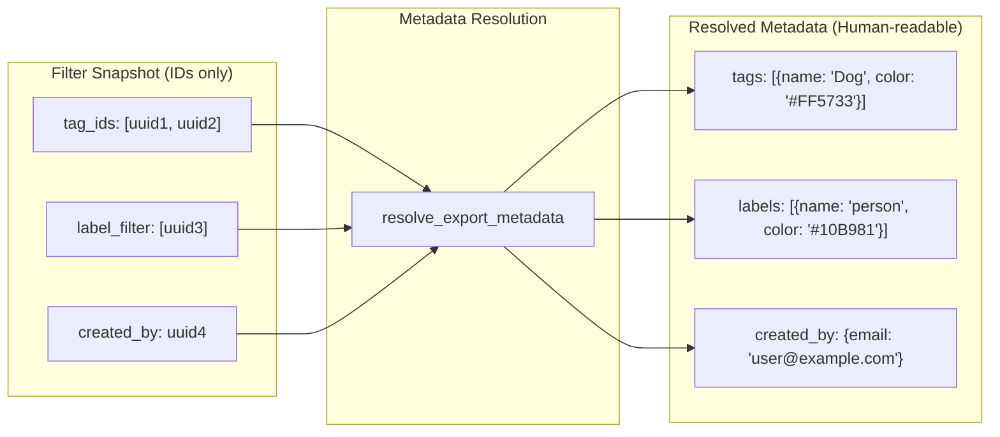
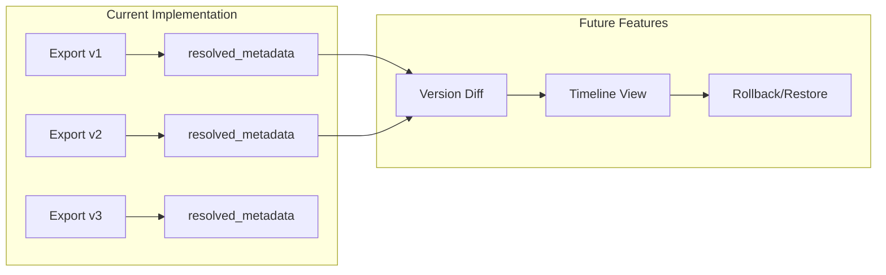

# Export Workflow Guide

This document describes the complete workflow for exporting annotations from Annotate ANU.

## Overview

The Export feature allows you to export your annotated dataset in various formats for use in machine learning pipelines. Exports are **filter-aware**, meaning you can export a subset of your data based on applied filters.

Key features:
- **Self-documenting exports**: COCO JSON files contain full export configuration
- **Data versioning foundation**: Resolved metadata stored for future diff/comparison
- **Reproducibility**: Anyone can understand exactly what was exported and how

## Workflow Diagram



## Sequence Diagram



## State Diagram



## Data Versioning Architecture

### Resolved Metadata

When an export is created, all filter IDs are **resolved to human-readable names** and stored in the `resolved_metadata` field. This creates a **point-in-time snapshot** of the export configuration.



### Why Store Resolved Metadata?

| Reason | Explanation |
|--------|-------------|
| **Point-in-time snapshot** | Tags/labels may be renamed or deleted later; resolved metadata preserves the state at export time |
| **Self-documenting exports** | Exported COCO JSON files contain full configuration in the `info` section |
| **Data versioning foundation** | Enables future diff/comparison between export versions |
| **No extra API calls** | Frontend displays tag/label names directly from response without fetching separately |

### Resolved Metadata Structure

```json
{
  "tags": [
    {"id": "uuid", "name": "Dog", "color": "#FF5733"},
    {"id": "uuid", "name": "Cat", "color": "#3498DB"}
  ],
  "excluded_tags": [
    {"id": "uuid", "name": "Blurry", "color": "#999999"}
  ],
  "labels": [
    {"id": "uuid", "name": "person", "color": "#10B981"},
    {"id": "uuid", "name": "car", "color": "#F59E0B"}
  ],
  "created_by": {
    "id": "uuid",
    "email": "user@example.com",
    "full_name": "John Doe"
  },
  "project": {
    "id": 12,
    "name": "Object Detection Dataset"
  },
  "filter_summary": {
    "tag_count": 2,
    "excluded_tag_count": 1,
    "label_count": 2,
    "include_match_mode": "OR",
    "exclude_match_mode": "OR"
  }
}
```

## Export Modes

### 1. Classification Export
Export image-level class labels for image classification tasks.

**Use case**: Training image classifiers (cats vs dogs, product categories, etc.)

**Output formats**:
- **CSV Manifest**: File with `image_path,class_name,split` columns
- **ImageFolder**: Directory structure organized by class name

**Configuration**:
- **Categorized**: Automatically map tags from a specific category to class names
- **Free-form**: Manually map multiple tags to custom class names

### 2. Detection Export
Export bounding box annotations for object detection tasks.

**Use case**: Training object detectors (YOLO, Faster R-CNN, etc.)

**Output format**: COCO JSON format with embedded export metadata

**Options**:
- Include bounding boxes derived from segmentation polygons

### 3. Segmentation Export
Export polygon/mask annotations for instance segmentation tasks.

**Use case**: Training segmentation models (Mask R-CNN, SAM, etc.)

**Output format**: COCO JSON format with embedded export metadata

**Options**:
- Include bounding boxes alongside segmentations
- Convert detection bboxes to polygon format

## Task Splits

Tasks can be assigned to dataset splits for proper train/validation/test separation:

| Split | Purpose |
|-------|---------|
| **Train** | Used for model training |
| **Val** | Used for validation during training |
| **Test** | Held out for final evaluation |
| **None** | Unassigned (excluded from split-based exports) |

### Setting Task Splits

1. Navigate to **Project > Tasks** tab
2. Find the task in the list
3. Use the **split dropdown** on the task card
4. Select: None, Train, Val, or Test

Splits are stored at the task level and apply to all images within that task.

## Filter System

The export uses the **current filter state** from the Explore view. This allows you to export specific subsets of your data.

### Available Filters

| Filter Type | Description |
|-------------|-------------|
| **Tags** | Include/exclude images with specific tags |
| **Task** | Filter by specific tasks |
| **Annotation Status** | Annotated only / Not annotated only |
| **Search** | Filename search |
| **Metadata** | Width, height, file size ranges |
| **Filepath** | Directory path filters |

### Filter Logic

- **Include tags**: Images must have ANY (OR) or ALL (AND) of the selected tags
- **Exclude tags**: Images must NOT have ANY (OR) or ALL (AND) of the excluded tags

## Export Wizard Steps

### Step 1: Mode Selection
Choose the export mode based on your annotation type:
- Classification (tags to classes)
- Detection (bounding boxes)
- Segmentation (polygons/masks)

### Step 2: Mode Configuration
Configure mode-specific options:

**For Classification**:
- Select categorized or free-form mapping
- Define class-to-tag mappings

**For Detection**:
- Enable/disable bbox from segmentation conversion
- Filter by annotation labels

**For Segmentation**:
- Enable/disable bbox inclusion
- Enable/disable bbox-to-polygon conversion
- Filter by annotation labels

### Step 3: Version & Options
- **Version Mode**: Latest, specific job version, or timestamp
- **Include Images**: Whether to include image files in the export

### Step 4: Preview & Confirm
Review export summary:
- Total images count
- Annotation counts
- Split distribution (train/val/test)
- Class distribution

Click **Export** to start the export job.

### Step 5: Download
Once processing completes:
- View export status
- Download the artifact (ZIP file)

## Output Artifacts

### COCO JSON Format (Detection/Segmentation)

COCO JSON exports include comprehensive metadata in the `info` section for self-documentation and reproducibility:

```json
{
  "info": {
    "description": "Exported from Annotate ANU",
    "version": "1.0",
    "year": 2025,
    "date_created": "2025-12-27T10:30:00Z",
    "contributor": "John Doe <john@example.com>",
    "export_config": {
      "export_id": "550e8400-e29b-41d4-a716-446655440000",
      "version_number": 3,
      "export_mode": "detection",
      "output_format": "coco_json",
      "include_images": true,
      "project": {
        "id": 12,
        "name": "Object Detection Dataset"
      },
      "filter": {
        "tags": [
          {"id": "uuid-1", "name": "Dog", "color": "#FF5733"},
          {"id": "uuid-2", "name": "Cat", "color": "#3498DB"}
        ],
        "excluded_tags": [],
        "include_match_mode": "OR",
        "exclude_match_mode": "OR",
        "task_ids": [1, 2],
        "is_annotated": true
      },
      "labels": [
        {"id": "uuid-3", "name": "person", "color": "#10B981"},
        {"id": "uuid-4", "name": "car", "color": "#F59E0B"}
      ],
      "splits": {
        "train": 800,
        "val": 200,
        "test": 100
      },
      "statistics": {
        "image_count": 1100,
        "annotation_count": 5678
      }
    }
  },
  "images": [
    { "id": 1, "file_name": "image001.jpg", "width": 1920, "height": 1080 }
  ],
  "annotations": [
    { "id": 1, "image_id": 1, "category_id": 1, "bbox": [100, 200, 300, 400], "area": 120000, "iscrowd": 0 }
  ],
  "categories": [
    { "id": 1, "name": "person", "supercategory": "" }
  ]
}
```

### Export Config Fields

| Field | Description |
|-------|-------------|
| `export_id` | Unique identifier for this export |
| `version_number` | Auto-incrementing version per mode |
| `export_mode` | classification, detection, or segmentation |
| `output_format` | coco_json, manifest_csv, or image_folder |
| `include_images` | Whether image files are included |
| `project` | Project ID and name |
| `filter.tags` | Tags used for filtering (with names and colors) |
| `filter.excluded_tags` | Tags excluded from filtering |
| `filter.include_match_mode` | AND or OR logic for tag inclusion |
| `filter.task_ids` | Specific task IDs if filtered |
| `filter.is_annotated` | Whether only annotated images are included |
| `labels` | Annotation labels included (with names and colors) |
| `splits` | Count of images per split (train/val/test) |
| `statistics` | Total image and annotation counts |

### CSV Manifest Format (Classification)

```csv
image_path,class_name,split
images/cat001.jpg,cat,train
images/dog002.jpg,dog,val
images/cat003.jpg,cat,test
```

### ImageFolder Format (Classification)

```
export/
  train/
    cat/
      image001.jpg
      image003.jpg
    dog/
      image002.jpg
  val/
    cat/
      image004.jpg
```

## Best Practices

1. **Set splits before export**: Assign train/val/test splits to tasks before exporting
2. **Use filters intentionally**: Apply filters to export specific subsets
3. **Verify preview**: Always check the preview counts before creating an export
4. **Use consistent labeling**: Ensure consistent tag/label usage across annotators
5. **Export versioned data**: Use job versions for reproducible exports
6. **Review embedded metadata**: Check the COCO JSON `info.export_config` to verify export settings

## Export History & Versioning

### Auto-Versioning

Exports are automatically versioned per project and mode combination. Each new export receives:
- **Auto-incrementing version number**: e.g., v1, v2, v3 (per export mode)
- **Auto-generated name**: e.g., "Detection Export v3", "Classification Export v1"

This enables clear tracking of export iterations without manual naming.

### History Tab

The **History tab** in the Project page provides a unified view of all project activity:

```
+-------------------------------------------------------------+
| History Tab                                                 |
+-------------------------------------------------------------+
|                                                             |
| +- Activity Timeline ------------------------------------+ |
| | * task    Admin created "Batch 1"                5m ago | |
| | * export  Detection Export v3 completed          2h ago | |
| | * job     Status changed: draft -> review        3h ago | |
| | * filter  "Training Set" saved                   1d ago | |
| +--------------------------------------------------------+ |
|                                                             |
| v Saved Filters -----------------------------------------   |
| | [Save Current]                                          | |
| | +- Training Set Filter (3 tags) Created Dec 27          | |
| | +- Validation Set (2 tasks) Created Dec 27              | |
|                                                             |
| v Export History ----------------------------------------   |
| | [Refresh]                                               | |
| | +- Detection Export v3 | v3 | COCO | Completed [DL][X]  | |
| | |   Tags: [Dog] [Cat]  Labels: [person] [car]           | |
| | |   1,234 images * 5,678 annotations * 5.2 MB           | |
| | |   train: 800 | val: 200 | test: 100                   | |
| | |   Created by John Doe * Dec 27, 2025                  | |
| | +- Classification Export v2 | v2 | CSV | Completed      | |
| | +- Segmentation Export v1 | v1 | COCO | Failed          | |
+-------------------------------------------------------------+
```

### Export History Panel

View past exports in the Export History panel:
- **Name & Version**: Auto-generated name with version badge (e.g., "Detection Export v3")
- **Mode badge**: Classification, Detection, or Segmentation icon
- **Format badge**: COCO JSON, CSV, or ImageFolder
- **Status**: Pending, Processing, Completed, Failed
- **Tags used**: Colored chips showing included/excluded tags
- **Labels used**: Colored chips showing annotation labels
- **Splits breakdown**: Train/Val/Test distribution
- **Metadata**: Creation timestamp, image count, annotation count, file size, creator
- **Actions**: Download completed artifacts, delete old exports, view filter in Explore

### Saved Filters Panel

Save and reuse filter configurations:
- **Save current filter**: Capture the current Explore tab filter state
- **Apply saved filter**: Quickly apply a previously saved filter
- **Manage filters**: Rename, update, or delete saved filters
- **Use in exports**: Reference saved filters when creating exports

### Activity Logging

Export events are automatically logged to the Activity Timeline:
- **Export created**: When a new export is initiated
- **Export completed**: When the export finishes successfully (with image/annotation counts)
- **Export failed**: When an export encounters an error (with error details)

## Future: Data Versioning Features

With `resolved_metadata` stored in the database, future features can include:



| Feature | Description |
|---------|-------------|
| **Version Diff** | Compare two exports to show what changed (tags added/removed, labels changed) |
| **Timeline View** | Visual history of dataset evolution with diffs between versions |
| **Rollback/Restore** | Re-create a previous export with the exact same configuration |
| **Dataset Lineage** | Track how datasets evolved over time for ML reproducibility |

## Technical Details

### Storage Location
Exports are stored at: `/data/exports/{project_id}/{export_id}/`

### Background Processing
Exports run as background Celery tasks. Large exports may take several minutes.

### API Endpoints

#### Exports

| Endpoint | Method | Description |
|----------|--------|-------------|
| `/api/v1/projects/{id}/exports/preview` | POST | Preview export counts |
| `/api/v1/projects/{id}/exports` | POST | Create new export (auto-generates name, version & resolved_metadata) |
| `/api/v1/projects/{id}/exports` | GET | List export history with resolved_metadata |
| `/api/v1/projects/{id}/exports/{export_id}` | GET | Get export details with resolved_metadata |
| `/api/v1/projects/{id}/exports/{export_id}/download` | GET | Download artifact |
| `/api/v1/projects/{id}/exports/{export_id}` | DELETE | Delete export |
| `/api/v1/projects/{id}/exports/classification-options` | GET | Get tag categories & labels |

#### Saved Filters

| Endpoint | Method | Description |
|----------|--------|-------------|
| `/api/v1/projects/{id}/saved-filters` | GET | List saved filters |
| `/api/v1/projects/{id}/saved-filters` | POST | Create saved filter |
| `/api/v1/projects/{id}/saved-filters/{filter_id}` | GET | Get filter details |
| `/api/v1/projects/{id}/saved-filters/{filter_id}` | PUT | Update filter |
| `/api/v1/projects/{id}/saved-filters/{filter_id}` | DELETE | Delete filter |

### Export Response Fields

| Field | Type | Description |
|-------|------|-------------|
| `id` | UUID | Unique export identifier |
| `name` | string | Auto-generated or user-provided name (e.g., "Detection Export v3") |
| `version_number` | integer | Auto-incrementing version per project+mode |
| `export_mode` | enum | classification, detection, segmentation |
| `output_format` | enum | coco_json, manifest_csv, image_folder |
| `status` | enum | pending, processing, completed, failed |
| `filter_snapshot` | object | Original filter with IDs |
| `resolved_metadata` | object | Human-readable metadata (tags, labels, user, project) |
| `summary` | object | Image count, annotation counts, class distribution |
| `artifact_size_bytes` | integer | Size of the export ZIP file |
| `created_by` | UUID | User ID who created the export |
| `created_by_user` | object | User info (id, email, full_name) |
| `created_at` | datetime | Export creation timestamp |
| `completed_at` | datetime | Export completion timestamp |

### Resolved Metadata Response Fields

| Field | Type | Description |
|-------|------|-------------|
| `tags` | array | Included tags with id, name, color |
| `excluded_tags` | array | Excluded tags with id, name, color |
| `labels` | array | Annotation labels with id, name, color |
| `created_by` | object | User info (id, email, full_name) |
| `project` | object | Project info (id, name) |
| `filter_summary` | object | Summary counts and match modes |

### Database Schema

The `exports` table includes:

```sql
CREATE TABLE exports (
    id UUID PRIMARY KEY,
    project_id INTEGER NOT NULL,
    name VARCHAR(255),
    version_number INTEGER,
    export_mode VARCHAR(20) NOT NULL,
    output_format VARCHAR(20) NOT NULL,
    include_images BOOLEAN DEFAULT FALSE,
    filter_snapshot JSONB NOT NULL,        -- Original filter (IDs)
    saved_filter_id UUID,
    classification_config JSONB,
    mode_options JSONB,
    version_mode VARCHAR(20) NOT NULL,
    version_value VARCHAR(100),
    status VARCHAR(20) DEFAULT 'pending',
    artifact_path VARCHAR(500),
    artifact_size_bytes BIGINT,
    message TEXT,
    error_message TEXT,
    summary JSONB,
    resolved_metadata JSONB,               -- Human-readable metadata
    created_by UUID,
    created_at TIMESTAMP DEFAULT NOW(),
    completed_at TIMESTAMP
);
```
