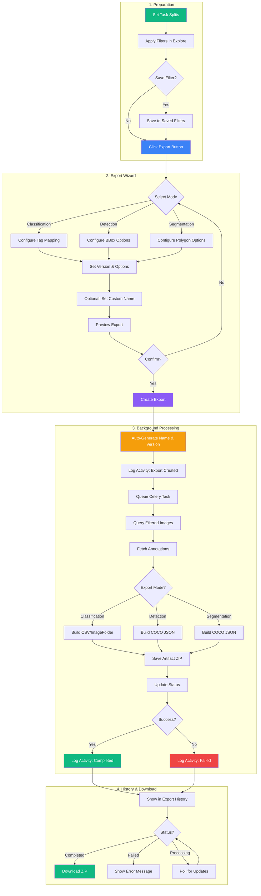
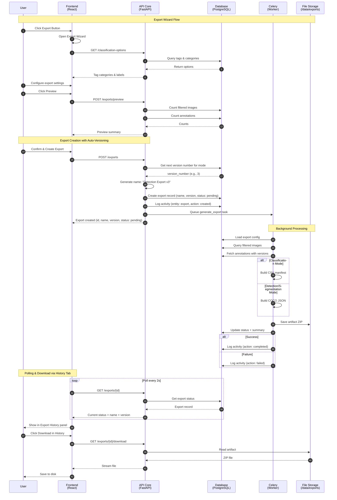
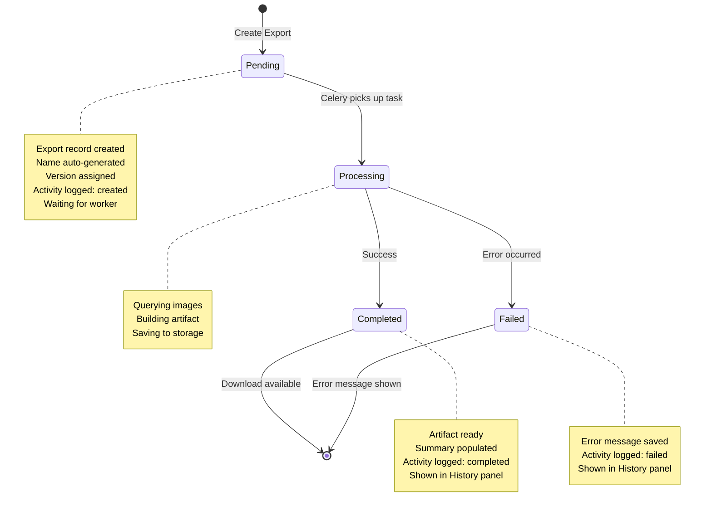

# Export Workflow Guide

This document describes the complete workflow for exporting annotations from Annotate ANU.

## Overview

The Export feature allows you to export your annotated dataset in various formats for use in machine learning pipelines. Exports are **filter-aware**, meaning you can export a subset of your data based on applied filters.

## Workflow Diagram



## Sequence Diagram



## State Diagram



## Export Modes

### 1. Classification Export
Export image-level class labels for image classification tasks.

**Use case**: Training image classifiers (cats vs dogs, product categories, etc.)

**Output formats**:
- **CSV Manifest**: File with `image_path,class_name,split` columns
- **ImageFolder**: Directory structure organized by class name

**Configuration**:
- **Categorized**: Automatically map tags from a specific category to class names
- **Free-form**: Manually map multiple tags to custom class names

### 2. Detection Export
Export bounding box annotations for object detection tasks.

**Use case**: Training object detectors (YOLO, Faster R-CNN, etc.)

**Output format**: COCO JSON format

**Options**:
- Include bounding boxes derived from segmentation polygons

### 3. Segmentation Export
Export polygon/mask annotations for instance segmentation tasks.

**Use case**: Training segmentation models (Mask R-CNN, SAM, etc.)

**Output format**: COCO JSON format

**Options**:
- Include bounding boxes alongside segmentations
- Convert detection bboxes to polygon format

## Task Splits

Tasks can be assigned to dataset splits for proper train/validation/test separation:

| Split | Purpose |
|-------|---------|
| **Train** | Used for model training |
| **Val** | Used for validation during training |
| **Test** | Held out for final evaluation |
| **None** | Unassigned (excluded from split-based exports) |

### Setting Task Splits

1. Navigate to **Project > Tasks** tab
2. Find the task in the list
3. Use the **split dropdown** on the task card
4. Select: None, Train, Val, or Test

Splits are stored at the task level and apply to all images within that task.

## Filter System

The export uses the **current filter state** from the Explore view. This allows you to export specific subsets of your data.

### Available Filters

| Filter Type | Description |
|-------------|-------------|
| **Tags** | Include/exclude images with specific tags |
| **Task** | Filter by specific tasks |
| **Annotation Status** | Annotated only / Not annotated only |
| **Search** | Filename search |
| **Metadata** | Width, height, file size ranges |
| **Filepath** | Directory path filters |

### Filter Logic

- **Include tags**: Images must have ANY (OR) or ALL (AND) of the selected tags
- **Exclude tags**: Images must NOT have ANY (OR) or ALL (AND) of the excluded tags

## Export Wizard Steps

### Step 1: Mode Selection
Choose the export mode based on your annotation type:
- Classification (tags to classes)
- Detection (bounding boxes)
- Segmentation (polygons/masks)

### Step 2: Mode Configuration
Configure mode-specific options:

**For Classification**:
- Select categorized or free-form mapping
- Define class-to-tag mappings

**For Detection**:
- Enable/disable bbox from segmentation conversion
- Filter by annotation labels

**For Segmentation**:
- Enable/disable bbox inclusion
- Enable/disable bbox-to-polygon conversion
- Filter by annotation labels

### Step 3: Version & Options
- **Version Mode**: Latest, specific job version, or timestamp
- **Include Images**: Whether to include image files in the export

### Step 4: Preview & Confirm
Review export summary:
- Total images count
- Annotation counts
- Split distribution (train/val/test)
- Class distribution

Click **Export** to start the export job.

### Step 5: Download
Once processing completes:
- View export status
- Download the artifact (ZIP file)

## Output Artifacts

### COCO JSON Format (Detection/Segmentation)

```json
{
  "info": { "description": "Annotate ANU Export", ... },
  "images": [
    { "id": 1, "file_name": "image001.jpg", "width": 1920, "height": 1080 }
  ],
  "annotations": [
    { "id": 1, "image_id": 1, "category_id": 1, "bbox": [x, y, w, h], "segmentation": [[...]] }
  ],
  "categories": [
    { "id": 1, "name": "person" }
  ]
}
```

### CSV Manifest Format (Classification)

```csv
image_path,class_name,split
images/cat001.jpg,cat,train
images/dog002.jpg,dog,val
images/cat003.jpg,cat,test
```

### ImageFolder Format (Classification)

```
export/
  train/
    cat/
      image001.jpg
      image003.jpg
    dog/
      image002.jpg
  val/
    cat/
      image004.jpg
```

## Best Practices

1. **Set splits before export**: Assign train/val/test splits to tasks before exporting
2. **Use filters intentionally**: Apply filters to export specific subsets
3. **Verify preview**: Always check the preview counts before creating an export
4. **Use consistent labeling**: Ensure consistent tag/label usage across annotators
5. **Export versioned data**: Use job versions for reproducible exports

## Export History & Versioning

### Auto-Versioning

Exports are automatically versioned per project and mode combination. Each new export receives:
- **Auto-incrementing version number**: e.g., v1, v2, v3 (per export mode)
- **Auto-generated name**: e.g., "Detection Export v3", "Classification Export v1"

This enables clear tracking of export iterations without manual naming.

### History Tab

The **History tab** in the Project page provides a unified view of all project activity:

```
┌─────────────────────────────────────────────────────────────┐
│ History Tab                                                 │
├─────────────────────────────────────────────────────────────┤
│                                                             │
│ ┌─ Activity Timeline ─────────────────────────────────────┐ │
│ │ ● task    Admin created "Batch 1"                5m ago │ │
│ │ ● export  Detection Export v3 completed          2h ago │ │
│ │ ● job     Status changed: draft → review         3h ago │ │
│ │ ● filter  "Training Set" saved                   1d ago │ │
│ └─────────────────────────────────────────────────────────┘ │
│                                                             │
│ ▼ Saved Filters ──────────────────────────────────────────  │
│ │ [Save Current]                                          │ │
│ │ ├─ Training Set Filter (3 tags) Created Dec 27          │ │
│ │ └─ Validation Set (2 tasks) Created Dec 27              │ │
│                                                             │
│ ▼ Export History ─────────────────────────────────────────  │
│ │ [Refresh]                                               │ │
│ │ ├─ Detection Export v3 | COCO | Completed  [↓] [🗑]     │ │
│ │ │   1,234 images • 5.2 MB • Dec 27                      │ │
│ │ ├─ Classification Export v2 | CSV | Completed           │ │
│ │ └─ Segmentation Export v1 | COCO | Failed               │ │
└─────────────────────────────────────────────────────────────┘
```

### Export History Panel

View past exports in the Export History panel:
- **Name & Version**: Auto-generated name with version (e.g., "Detection Export v3")
- **Mode badge**: Classification, Detection, or Segmentation
- **Format badge**: COCO JSON, CSV, or ImageFolder
- **Status**: Pending, Processing, Completed, Failed
- **Metadata**: Creation timestamp, image count, annotation count, file size
- **Actions**: Download completed artifacts, delete old exports

### Saved Filters Panel

Save and reuse filter configurations:
- **Save current filter**: Capture the current Explore tab filter state
- **Apply saved filter**: Quickly apply a previously saved filter
- **Manage filters**: Rename, update, or delete saved filters
- **Use in exports**: Reference saved filters when creating exports

### Activity Logging

Export events are automatically logged to the Activity Timeline:
- **Export created**: When a new export is initiated
- **Export completed**: When the export finishes successfully (with image/annotation counts)
- **Export failed**: When an export encounters an error (with error details)

## Technical Details

### Storage Location
Exports are stored at: `/data/exports/{project_id}/{export_id}/`

### Background Processing
Exports run as background Celery tasks. Large exports may take several minutes.

### API Endpoints

#### Exports

| Endpoint | Method | Description |
|----------|--------|-------------|
| `/api/v1/projects/{id}/exports/preview` | POST | Preview export counts |
| `/api/v1/projects/{id}/exports` | POST | Create new export (auto-generates name & version) |
| `/api/v1/projects/{id}/exports` | GET | List export history |
| `/api/v1/projects/{id}/exports/{export_id}` | GET | Get export details |
| `/api/v1/projects/{id}/exports/{export_id}/download` | GET | Download artifact |
| `/api/v1/projects/{id}/exports/{export_id}` | DELETE | Delete export |
| `/api/v1/projects/{id}/exports/classification-options` | GET | Get tag categories & labels |

#### Saved Filters

| Endpoint | Method | Description |
|----------|--------|-------------|
| `/api/v1/projects/{id}/saved-filters` | GET | List saved filters |
| `/api/v1/projects/{id}/saved-filters` | POST | Create saved filter |
| `/api/v1/projects/{id}/saved-filters/{filter_id}` | GET | Get filter details |
| `/api/v1/projects/{id}/saved-filters/{filter_id}` | PUT | Update filter |
| `/api/v1/projects/{id}/saved-filters/{filter_id}` | DELETE | Delete filter |

### Export Response Fields

| Field | Type | Description |
|-------|------|-------------|
| `id` | UUID | Unique export identifier |
| `name` | string | Auto-generated or user-provided name (e.g., "Detection Export v3") |
| `version_number` | integer | Auto-incrementing version per project+mode |
| `export_mode` | enum | classification, detection, segmentation |
| `output_format` | enum | coco_json, manifest_csv, image_folder |
| `status` | enum | pending, processing, completed, failed |
| `summary` | object | Image count, annotation counts, class distribution |
| `artifact_size_bytes` | integer | Size of the export ZIP file |
| `created_at` | datetime | Export creation timestamp |
| `completed_at` | datetime | Export completion timestamp |
