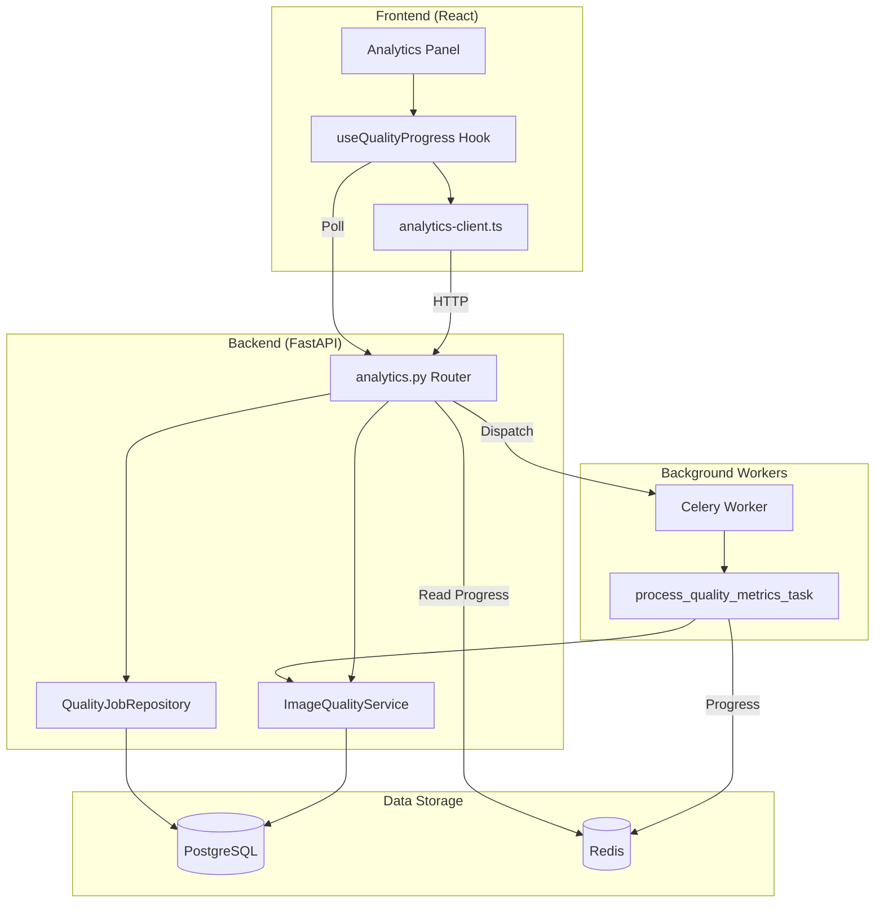
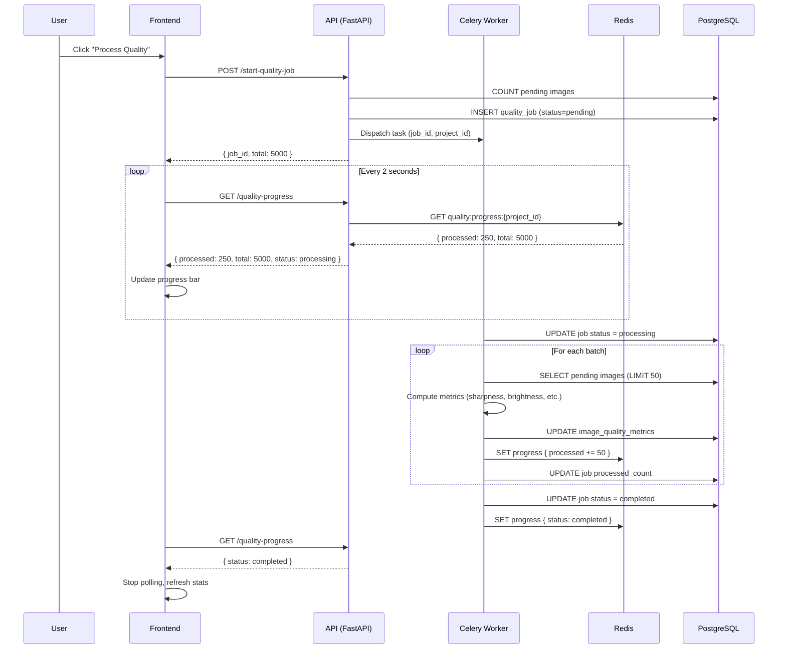
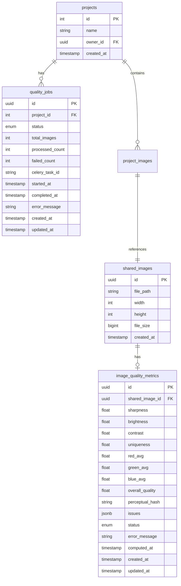
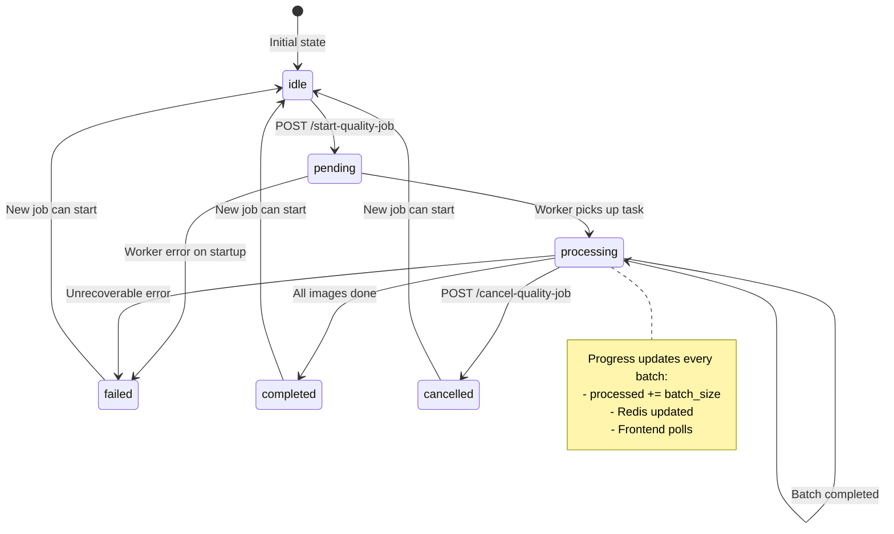
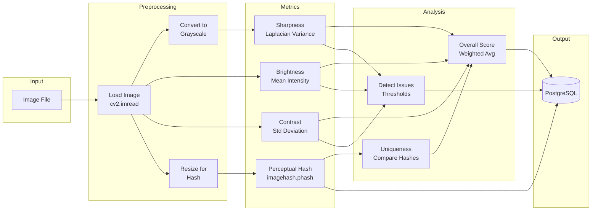

# Quality Metrics Workflow

> Background processing system for computing image quality metrics with real-time progress tracking.

## Table of Contents

- [Overview](#overview)
- [Problem Statement](#problem-statement)
- [Architecture](#architecture)
- [Database Schema](#database-schema)
- [API Endpoints](#api-endpoints)
- [Frontend Components](#frontend-components)
- [Workflow Diagrams](#workflow-diagrams)
- [Implementation Details](#implementation-details)
- [Testing](#testing)

---

## Overview

The Quality Metrics Workflow provides automated computation of image quality metrics (sharpness, brightness, contrast, uniqueness) for datasets. It supports:

- **Automatic Processing**: Triggered on image upload
- **Manual Processing**: User-initiated from the Analytics panel
- **Real-time Progress**: 2-second polling with accurate counts
- **Cancellation**: Stop running jobs at any time
- **Scalability**: Handles thousands of images via batch processing

### Key Features

| Feature | Description |
|---------|-------------|
| Background Processing | Celery workers handle computation asynchronously |
| Progress Tracking | Redis-based real-time progress updates |
| Accurate Counts | Server-side totals prevent display bugs |
| Job Management | Start, monitor, and cancel jobs per project |
| Auto-trigger | New uploads automatically queue for processing |

---

## Problem Statement

### Original Bug: "4850 / 562 images processed"

The previous implementation had a critical display bug where `processed > total`:

```
┌─────────────────────────────────────────────────────────────────┐
│  BEFORE (Broken)                                                │
├─────────────────────────────────────────────────────────────────┤
│                                                                 │
│  1. Frontend estimates totalToProcess = 562 (initial pending)   │
│                                                                 │
│  2. Frontend loops: POST /compute-quality (batch of 50)         │
│     └─> Backend processes 50, returns { processed: 50 }        │
│     └─> Frontend: processedCount += 50  (accumulating)         │
│                                                                 │
│  3. Backend discovers MORE untracked images each batch          │
│     └─> Creates new pending records                             │
│     └─> Returns remaining: 500 (new images found!)             │
│                                                                 │
│  4. Loop continues... processedCount keeps growing              │
│     └─> Eventually: "4850 / 562" (processed > original total)  │
│                                                                 │
│  ROOT CAUSE: Frontend accumulates locally, backend discovers    │
│              new images, no single source of truth              │
└─────────────────────────────────────────────────────────────────┘
```

### Solution: Server-Side Job Management

```
┌─────────────────────────────────────────────────────────────────┐
│  AFTER (Fixed)                                                  │
├─────────────────────────────────────────────────────────────────┤
│                                                                 │
│  1. Frontend: POST /start-quality-job                           │
│     └─> Backend creates job with accurate COUNT(*) total       │
│     └─> Returns { job_id, total: 5000 }                        │
│                                                                 │
│  2. Celery worker processes batches in background               │
│     └─> Updates Redis: { processed: 250, total: 5000 }         │
│     └─> Total NEVER changes mid-job                            │
│                                                                 │
│  3. Frontend polls: GET /quality-progress (every 2s)            │
│     └─> Returns server-provided counts                         │
│     └─> Display: "250 / 5000" (always accurate)                │
│                                                                 │
│  SOLUTION: Single source of truth on server, frontend only     │
│            displays what server provides                        │
└─────────────────────────────────────────────────────────────────┘
```

---

## Architecture

### High-Level Architecture



### Component Interaction Sequence



---

## Database Schema

### Entity Relationship Diagram



### Table Definitions

#### `quality_jobs` - Job Tracking Table

```sql
CREATE TABLE quality_jobs (
    id UUID PRIMARY KEY DEFAULT gen_random_uuid(),
    project_id INTEGER NOT NULL REFERENCES projects(id) ON DELETE CASCADE,
    status quality_job_status NOT NULL DEFAULT 'pending',
    total_images INTEGER NOT NULL DEFAULT 0,
    processed_count INTEGER NOT NULL DEFAULT 0,
    failed_count INTEGER NOT NULL DEFAULT 0,
    celery_task_id VARCHAR(50),
    started_at TIMESTAMP WITH TIME ZONE,
    completed_at TIMESTAMP WITH TIME ZONE,
    error_message VARCHAR(500),
    created_at TIMESTAMP WITH TIME ZONE NOT NULL DEFAULT now(),
    updated_at TIMESTAMP WITH TIME ZONE NOT NULL DEFAULT now()
);

-- Indexes
CREATE INDEX ix_quality_jobs_project_id ON quality_jobs(project_id);
CREATE INDEX ix_quality_jobs_status ON quality_jobs(status);
CREATE INDEX ix_quality_jobs_created_at ON quality_jobs(created_at);

-- Enum type
CREATE TYPE quality_job_status AS ENUM (
    'pending',
    'processing',
    'completed',
    'failed',
    'cancelled'
);
```

#### `image_quality_metrics` - Per-Image Metrics Table

```sql
CREATE TABLE image_quality_metrics (
    id UUID PRIMARY KEY DEFAULT gen_random_uuid(),
    shared_image_id UUID NOT NULL UNIQUE REFERENCES shared_images(id) ON DELETE CASCADE,

    -- Quality metrics (normalized 0-1)
    sharpness FLOAT,          -- Laplacian variance, higher = sharper
    brightness FLOAT,         -- Mean pixel intensity, 0.3-0.7 optimal
    contrast FLOAT,           -- Std dev of pixels, higher = more contrast
    uniqueness FLOAT,         -- 1 - max similarity, 1 = unique

    -- RGB channel averages
    red_avg FLOAT,
    green_avg FLOAT,
    blue_avg FLOAT,

    -- Composite score
    overall_quality FLOAT,    -- Weighted average of individual metrics

    -- Duplicate detection
    perceptual_hash VARCHAR(64),  -- pHash for similarity comparison

    -- Detected issues
    issues JSONB DEFAULT '[]',    -- Array: blur, low_brightness, duplicate, etc.

    -- Processing status
    status quality_status NOT NULL DEFAULT 'pending',
    error_message VARCHAR(500),
    computed_at TIMESTAMP WITH TIME ZONE,

    created_at TIMESTAMP WITH TIME ZONE NOT NULL DEFAULT now(),
    updated_at TIMESTAMP WITH TIME ZONE NOT NULL DEFAULT now()
);

-- Indexes for filtering and querying
CREATE UNIQUE INDEX ix_image_quality_metrics_shared_image_id ON image_quality_metrics(shared_image_id);
CREATE INDEX ix_image_quality_metrics_status ON image_quality_metrics(status);
CREATE INDEX ix_image_quality_metrics_overall_quality ON image_quality_metrics(overall_quality);
CREATE INDEX ix_image_quality_metrics_sharpness ON image_quality_metrics(sharpness);
CREATE INDEX ix_image_quality_metrics_uniqueness ON image_quality_metrics(uniqueness);
CREATE INDEX ix_image_quality_metrics_perceptual_hash ON image_quality_metrics(perceptual_hash);

-- Enum type
CREATE TYPE quality_status AS ENUM (
    'pending',
    'processing',
    'completed',
    'failed'
);
```

### Redis Data Structure

Progress is stored in Redis for real-time updates:

```
Key: quality:progress:{project_id}
TTL: 1 hour (auto-expires after job completion)

Value (JSON):
{
    "job_id": "550e8400-e29b-41d4-a716-446655440000",
    "total": 5000,
    "processed": 2350,
    "failed": 12,
    "status": "processing",
    "started_at": "2026-01-02T10:00:00Z"
}
```

---

## API Endpoints

### Start Quality Job

```http
POST /api/v1/projects/{project_id}/analytics/start-quality-job
```

**Query Parameters:**
| Parameter | Type | Default | Description |
|-----------|------|---------|-------------|
| batch_size | int | 50 | Images per batch |

**Response:**
```json
{
    "success": true,
    "message": "Quality processing job started",
    "data": {
        "job_id": "550e8400-e29b-41d4-a716-446655440000",
        "total_images": 5000,
        "status": "pending",
        "message": "Job started, processing 5000 images"
    }
}
```

### Get Quality Progress

```http
GET /api/v1/projects/{project_id}/analytics/quality-progress
```

**Response:**
```json
{
    "success": true,
    "message": "Quality progress retrieved",
    "data": {
        "job_id": "550e8400-e29b-41d4-a716-446655440000",
        "total": 5000,
        "processed": 2350,
        "failed": 12,
        "remaining": 2638,
        "status": "processing",
        "progress_pct": 47.0,
        "started_at": "2026-01-02T10:00:00Z"
    }
}
```

**Status Values:**
| Status | Description |
|--------|-------------|
| `idle` | No active job |
| `pending` | Job created, waiting for worker |
| `processing` | Worker is processing batches |
| `completed` | All images processed |
| `failed` | Job failed with error |
| `cancelled` | User cancelled the job |

### Cancel Quality Job

```http
POST /api/v1/projects/{project_id}/analytics/cancel-quality-job
```

**Response:**
```json
{
    "success": true,
    "message": "Quality job cancelled",
    "data": {
        "cancelled": true,
        "message": "Job cancelled successfully"
    }
}
```

---

## Frontend Components

### useQualityProgress Hook

Location: `apps/web/src/hooks/useQualityProgress.ts`

```typescript
interface UseQualityProgressOptions {
  projectId: string;
  enabled?: boolean;
}

interface UseQualityProgressReturn {
  // Progress data
  progress: QualityProgressResponse | undefined;
  isLoading: boolean;
  isFetching: boolean;
  error: Error | null;
  refetch: () => void;

  // Derived state
  isProcessing: boolean;  // status === 'processing' || 'pending'
  isComplete: boolean;    // status === 'completed'
  isFailed: boolean;      // status === 'failed'
  isCancelled: boolean;   // status === 'cancelled'
  isIdle: boolean;        // status === 'idle' || no progress

  // Job actions
  startJob: (batchSize?: number) => void;
  startJobAsync: (batchSize?: number) => Promise<StartQualityJobResponse>;
  isStarting: boolean;
  startError: Error | null;

  cancelJob: () => void;
  cancelJobAsync: () => Promise<CancelQualityJobResponse>;
  isCancelling: boolean;
  cancelError: Error | null;

  // Convenience accessors
  processed: number;
  failed: number;
  total: number;
  remaining: number;
  progressPct: number;
  status: string;
  jobId: string | null;
  startedAt: string | null;
}
```

**Usage Example:**

```tsx
function QualityPanel({ projectId }: { projectId: string }) {
  const {
    isProcessing,
    processed,
    total,
    progressPct,
    startJob,
    cancelJob,
    isCancelling,
  } = useQualityProgress({ projectId });

  return (
    <div>
      {isProcessing ? (
        <div>
          <ProgressBar value={progressPct} />
          <span>{processed} / {total} images</span>
          <button onClick={() => cancelJob()} disabled={isCancelling}>
            {isCancelling ? 'Cancelling...' : 'Cancel'}
          </button>
        </div>
      ) : (
        <button onClick={() => startJob(50)}>
          Process Quality Metrics
        </button>
      )}
    </div>
  );
}
```

### Analytics Client

Location: `apps/web/src/lib/analytics-client.ts`

```typescript
export const analyticsApi = {
  // Start background quality job
  async startQualityJob(
    projectId: string,
    batchSize: number = 50
  ): Promise<StartQualityJobResponse>;

  // Poll for progress (call every 2 seconds)
  async getQualityProgress(
    projectId: string
  ): Promise<QualityProgressResponse>;

  // Cancel running job
  async cancelQualityJob(
    projectId: string
  ): Promise<CancelQualityJobResponse>;
};
```

---

## Workflow Diagrams

### Complete System Flow (ASCII)

```
┌─────────────────────────────────────────────────────────────────────────────────┐
│                       IMAGE QUALITY METRICS WORKFLOW                            │
└─────────────────────────────────────────────────────────────────────────────────┘

                              TRIGGER SOURCES
    ┌──────────────────┐   ┌──────────────────┐   ┌──────────────────┐
    │   Image Upload   │   │  Manual Trigger  │   │  (Future) Cron   │
    │  POST /images    │   │ POST /start-job  │   │   Celery Beat    │
    └────────┬─────────┘   └────────┬─────────┘   └────────┬─────────┘
             │                      │                      │
             └──────────────────────┼──────────────────────┘
                                    │
                                    ▼
    ┌─────────────────────────────────────────────────────────────────────────────┐
    │                         CELERY TASK QUEUE (Redis)                           │
    │  ┌─────────────────────────────────────────────────────────────────────┐    │
    │  │  process_quality_metrics_task(job_id, project_id, batch_size=50)    │    │
    │  └─────────────────────────────────────────────────────────────────────┘    │
    └─────────────────────────────────────────────────────────────────────────────┘
                                    │
                                    ▼
    ┌─────────────────────────────────────────────────────────────────────────────┐
    │                         CELERY WORKER PROCESSING                            │
    │                                                                             │
    │   ┌─────────────┐    ┌─────────────┐    ┌─────────────┐    ┌─────────────┐  │
    │   │ 1. COUNT    │───▶│ 2. FETCH    │───▶│ 3. COMPUTE  │───▶│ 4. UPDATE   │  │
    │   │ Total Work  │    │ Batch (50)  │    │ Metrics     │    │ Progress    │  │
    │   │ (accurate)  │    │ from DB     │    │ cv2/numpy   │    │ in Redis    │  │
    │   └─────────────┘    └─────────────┘    └─────────────┘    └──────┬──────┘  │
    │                                                                   │         │
    │   ┌─────────────────────────────────────────────────────────────┐ │         │
    │   │                      LOOP UNTIL DONE                        │◀┘         │
    │   │  • Check cancellation flag in Redis                         │           │
    │   │  • If remaining > 0: process next batch                     │           │
    │   │  • If remaining = 0: mark job complete                      │           │
    │   │  • If cancelled: mark job cancelled, stop                   │           │
    │   └─────────────────────────────────────────────────────────────┘           │
    └─────────────────────────────────────────────────────────────────────────────┘
                                    │
                                    ▼
    ┌─────────────────────────────────────────────────────────────────────────────┐
    │                         REDIS PROGRESS TRACKING                             │
    │                                                                             │
    │   Key: quality:progress:{project_id}                                        │
    │   Value: {                                                                  │
    │     "job_id": "uuid",                                                       │
    │     "total": 5000,        ◀── Accurate total (COUNT at job start)           │
    │     "processed": 2350,    ◀── Running count from worker                     │
    │     "failed": 12,         ◀── Failed count                                  │
    │     "status": "processing",                                                 │
    │     "started_at": "2026-01-02T10:00:00Z"                                    │
    │   }                                                                         │
    └─────────────────────────────────────────────────────────────────────────────┘
                                    │
                                    ▼
    ┌─────────────────────────────────────────────────────────────────────────────┐
    │                         FRONTEND POLLING (2s)                               │
    │                                                                             │
    │   GET /api/v1/projects/{id}/analytics/quality-progress                      │
    │                                                                             │
    │   ┌─────────────────────────────────────────────────────────────────────┐   │
    │   │  Progress Bar:  ████████████░░░░░░░░  47% (2350/5000)               │   │
    │   │  Status: Processing... | Failed: 12 | [Cancel]                      │   │
    │   └─────────────────────────────────────────────────────────────────────┘   │
    └─────────────────────────────────────────────────────────────────────────────┘
```

### State Machine Diagram



### Quality Metrics Computation Flow



---

## Implementation Details

### File Structure

```
apps/
├── api-core/
│   └── src/
│       └── app/
│           ├── models/
│           │   └── image_quality.py          # SQLAlchemy models
│           ├── repositories/
│           │   ├── image_quality.py          # Metrics CRUD
│           │   └── quality_job.py            # Job CRUD
│           ├── services/
│           │   └── image_quality_service.py  # Metric computation
│           ├── routers/
│           │   └── analytics.py              # API endpoints
│           ├── schemas/
│           │   └── analytics.py              # Pydantic schemas
│           └── tasks/
│               ├── main.py                   # Celery app config
│               └── quality.py                # Background task
│
└── web/
    └── src/
        ├── hooks/
        │   └── useQualityProgress.ts         # React Query hook
        ├── lib/
        │   └── analytics-client.ts           # API client
        └── components/
            └── analytics/
                └── panels/
                    └── EnhancedDatasetStatsPanel.tsx  # QualityTab UI
```

### Key Design Decisions

| Decision | Rationale |
|----------|-----------|
| **Celery for background processing** | Matches existing export job pattern; proven scalability |
| **Redis for progress** | Real-time updates; automatic expiration; low latency |
| **Single job per project** | Prevents resource contention; simpler state management |
| **Batch size of 50** | Balances throughput vs. progress granularity |
| **2-second polling** | Responsive UI without overwhelming server |
| **Server-side totals** | Single source of truth; prevents display bugs |

### Error Handling

```python
# Celery task with retry logic
@celery_app.task(bind=True, max_retries=3, default_retry_delay=60)
def process_quality_metrics_task(self, job_id, project_id, batch_size=50):
    try:
        # ... processing logic
    except Exception as exc:
        # Update job status to failed
        # Log error details
        # Retry if retries remaining
        raise self.retry(exc=exc)
```

### Cancellation Mechanism

```python
# Check cancellation flag in Redis before each batch
def should_cancel(project_id: int) -> bool:
    key = f"quality:cancel:{project_id}"
    return redis_client.get(key) == "1"

# In task loop:
while remaining > 0:
    if should_cancel(project_id):
        update_job_status(job_id, "cancelled")
        break
    process_batch(...)
```

---

## Testing

### Manual Testing Steps

1. **Start the application**
   ```bash
   make docker-up
   ```

2. **Navigate to Analytics**
   - Go to http://localhost:5173
   - Log in and select a project
   - Click "Explore" tab → Analytics panel → "Quality" tab

3. **Test Manual Trigger**
   - Click "Process" button
   - Observe progress bar updating every 2 seconds
   - Verify counts are accurate (processed <= total)

4. **Test Cancellation**
   - Start a processing job
   - Click "Cancel" button
   - Verify job stops and status shows "cancelled"

5. **Test Auto-trigger (Upload)**
   - Upload new images to a project
   - Check Celery worker logs for task dispatch
   - Verify progress appears in Quality tab

### Verify Database State

```sql
-- Check job history
SELECT id, status, total_images, processed_count, failed_count,
       started_at, completed_at
FROM quality_jobs
WHERE project_id = 11
ORDER BY created_at DESC
LIMIT 5;

-- Check metrics status distribution
SELECT status, COUNT(*)
FROM image_quality_metrics iqm
JOIN shared_images si ON si.id = iqm.shared_image_id
JOIN project_images pi ON pi.shared_image_id = si.id
WHERE pi.project_id = 11
GROUP BY status;

-- Check computed metrics
SELECT sharpness, brightness, contrast, uniqueness, overall_quality
FROM image_quality_metrics
WHERE status = 'completed'
LIMIT 10;
```

### Verify Celery Worker

```bash
# Check registered tasks
docker logs anu-api-core-worker-dev 2>&1 | grep "tasks"

# Expected output:
# [tasks]
#   . app.tasks.export.generate_export_task
#   . app.tasks.quality.process_quality_metrics_task

# Monitor task execution
docker logs -f anu-api-core-worker-dev
```

---

## Related Documentation

- [Analytics Panel Architecture](./analytics-panels.md)
- [Celery Task Configuration](../development/celery-setup.md)
- [Database Migrations](../development/migrations.md)

---

*Last updated: 2026-01-02*
